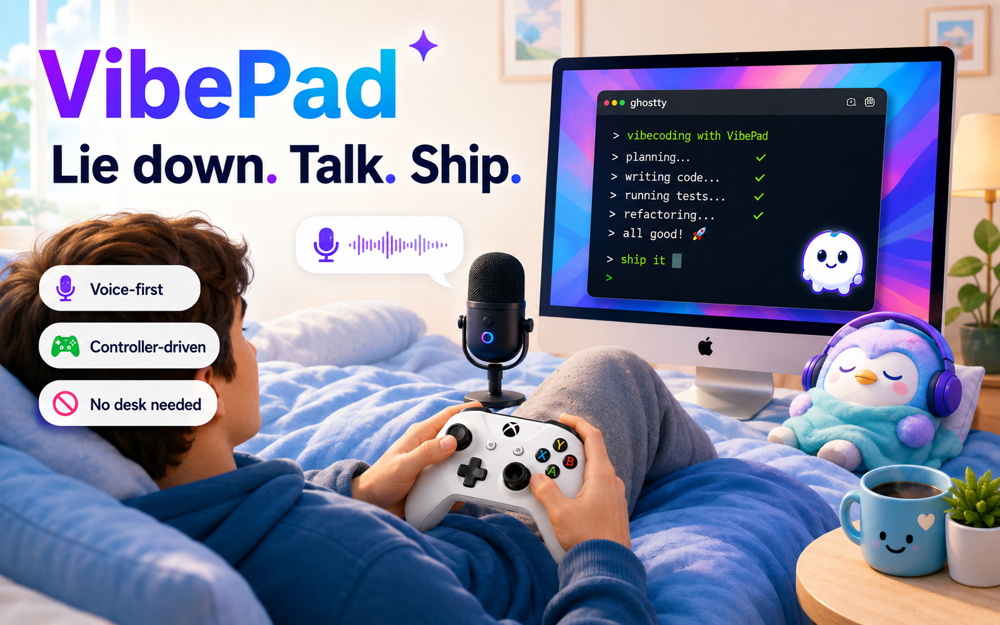
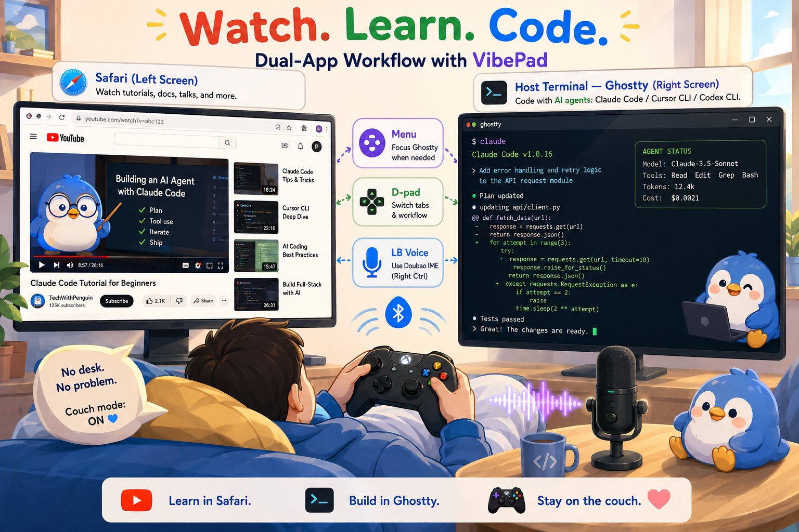
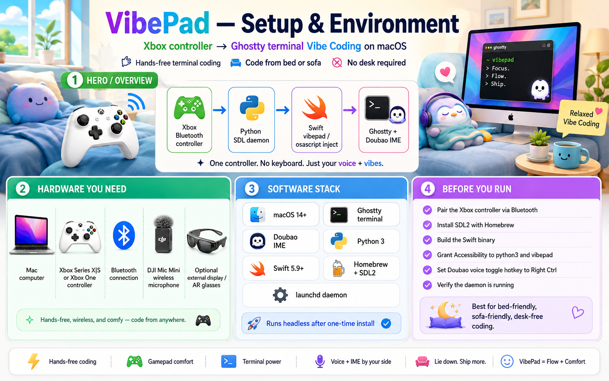
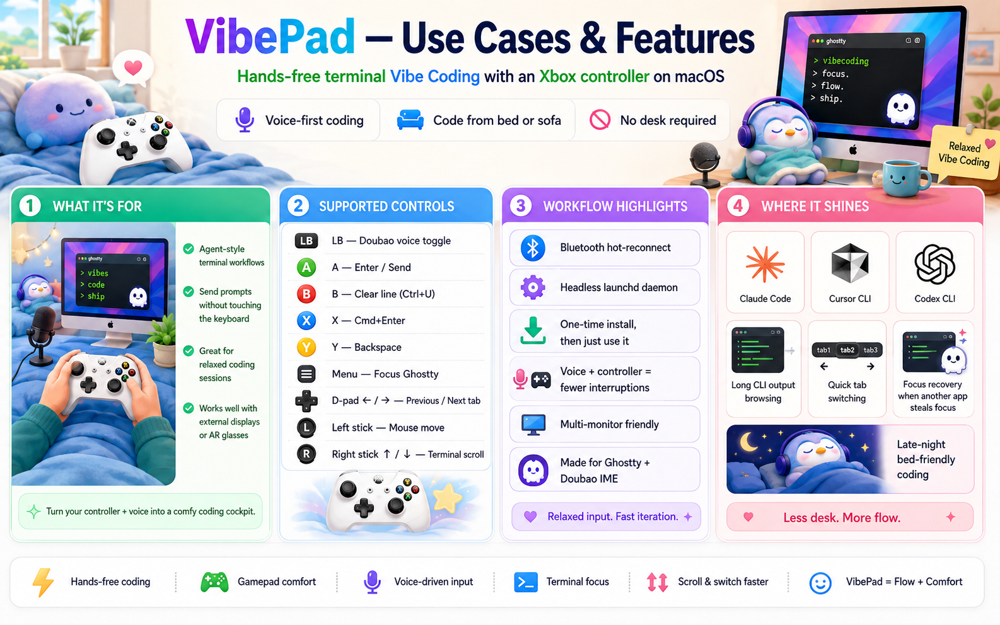
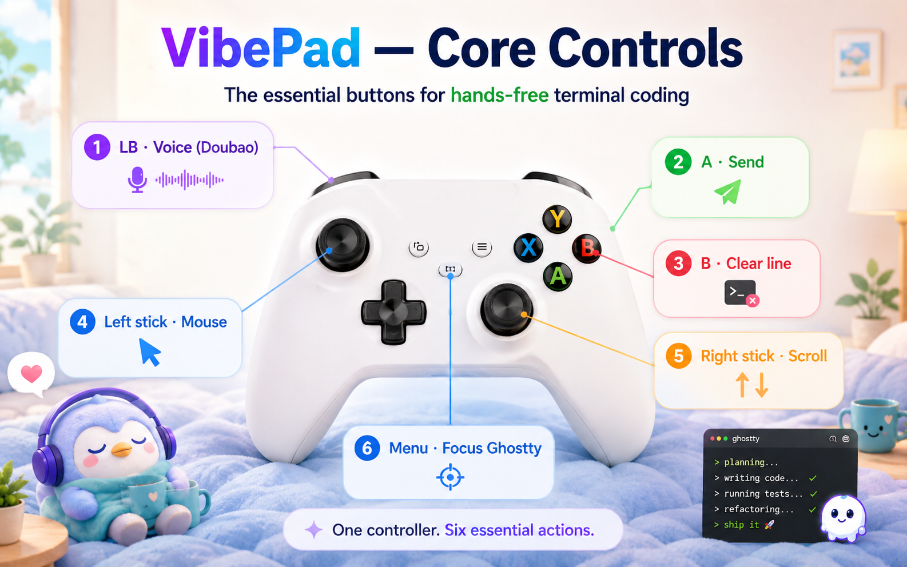
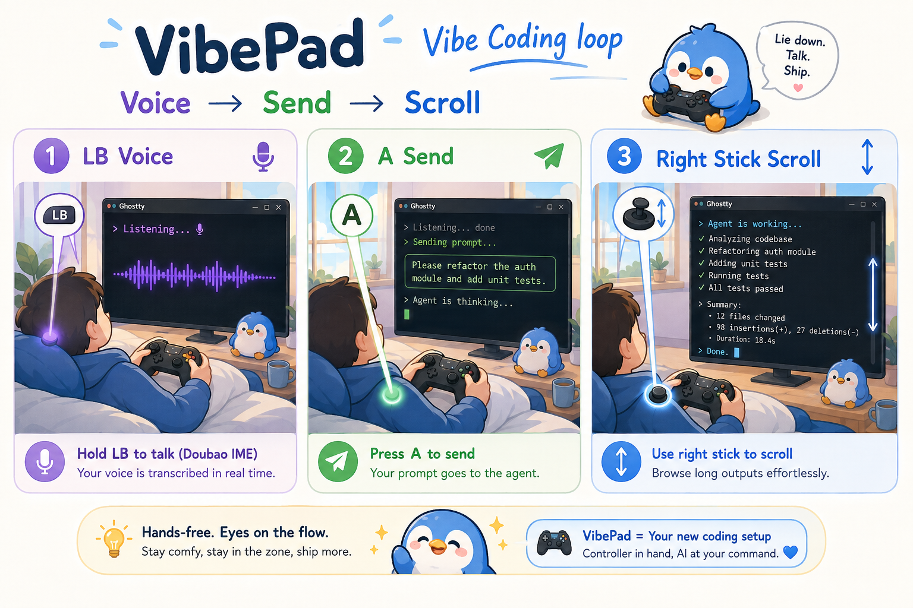

# VibePad

**Reinvent the boring macro-pad / desk-keyboard app** — Xbox controller → Ghostty **Vibe Coding** UX on macOS.

Lie down. Talk. Send. Scroll. Keep shipping with Claude Code / Cursor CLI / Codex — no desk required.

[](https://github.com/DISSIDIA-986/VibePad/releases)
**Repo:** https://github.com/DISSIDIA-986/VibePad · **Latest:** v0.1.3 · **Team:** DISSIDIA (Cursor Calgary · Aug 2026)  
**Slides:** https://dissidia-986.github.io/VibePad/







---

## Hackathon pitch

**Prompt:** *Choose a boring, everyday application format and reinvent it with a dramatically more engaging visual design, user experience, or functionality.*

| Boring everyday format | VibePad reinvention |
|------------------------|---------------------|
| Keyboard + mouse at a desk | **Couch / bed Vibe Coding** with an Xbox Bluetooth controller |
| Stream Deck / macro pad walls | **Game-controller UX** tuned for agent CLIs (send, clear, voice, tabs, scroll) |
| “Just remap buttons” utilities | **End-to-end workflow**: Ghostty + Doubao voice IME + multi-monitor pointer + Safari rest mode |

**Why it’s dramatically more engaging:** coding stops feeling like desk posture. You hold a familiar gamepad, toggle voice with **LB**, send prompts with **A**, clear mistakes with **B/Y**, jump tabs and zoom with the D-pad, aim with the left stick, and scroll long agent output with the right stick — then **RB** into Safari when you need a break.

> **Demo without a controller on site:** this README + the mapping table + screenshots below are the walkthrough. The production daemon is used daily on real hardware (see [Meet Me](#meet-me)).

---

## What it does

VibePad maps an **Xbox Bluetooth controller** to keyboard, mouse, and scroll input while you use **Ghostty** with **Doubao IME** (豆包 — Right Ctrl voice toggle).

Built for **agent-style terminal workflows**: send prompts, clear the input line, switch tabs, move the cursor across monitors, scroll long CLI output — without a desk setup.

```
Xbox Controller (Bluetooth)
  → Python SDL daemon (production)
  → Swift vibepad / osascript inject
  → Ghostty + Doubao IME
```

Runs **headless** via `launchd` after one-time install — no Terminal window left open.







---

## Controller mapping (verified v0.1.3)

| Input | Action | Notes |
|-------|--------|-------|
| **LB** | Doubao voice toggle | Synthetic Right Ctrl (`flagsChanged`) |
| **A** | Enter / send | Optimized for agent input box |
| **B** | Ctrl+U | Clear current input line |
| **X** | ⌘Enter | Fires on **release**; Ghostty fullscreen |
| **Y** | Backspace | Delete character |
| **Menu (Start)** | Focus Ghostty | Global — any frontmost app |
| **View (Back)** short tap | Toggle slash mode | Ghostty: `/` on, Esc off; R-stick ↑↓, A confirm, B Esc (~8s) |
| **View (Back)** hold ≥0.5s | Toggle choice mode | Ghostty CLI multi-choice: R-stick ↑↓, A/B/Y/Space (~6s) |
| **RB** | Focus Safari | Global — switch to video rest |
| **D-pad ← / →** | Previous / next tab | ⌘⇧[ / ⌘⇧] |
| **D-pad ↑ / ↓** | Font size zoom | ⌘= / ⌘− — Ghostty focused only |
| **Left stick** | Mouse move | Union of all displays (multi-monitor) |
| **Right stick ↑ / ↓** | Scroll | Ghostty *or* Safari focused |
| **Safari: A** | Space | Play / pause (video rest) |
| **Safari: B** | ⌘[ | Browser back |
| **Safari: X** | Click | Left click at cursor |
| **Safari: LT / RT** | ← / → | Seek back / forward |

### Also included (v0.1.3)

- **Bluetooth hot-reconnect** — power off the controller to save battery; mappings resume after reconnect (no manual restart).
- **Singleton daemon** — one spike process; duplicate watch scripts are blocked.
- **VibePad.app** (experimental) — menu-bar status + optional GameController path (production stack remains Python SDL spike).

### Not mapped (yet)

| Input | Status |
|-------|--------|
| Y / D-pad in Safari | Ignored (Ghostty-only) |
| Right stick ← / → | Unassigned (Y-axis scroll only) |

---

## Quick start

```bash
git clone https://github.com/DISSIDIA-986/VibePad.git
cd VibePad

brew install sdl2
swift build -c release

bin/install-daemon.sh      # launchd — recommended
bin/status-daemon.sh       # verify running
.build/release/vibepad doctor
```

**Accessibility** (System Settings → Privacy → Accessibility): grant **python3** and **vibepad** (`.build/release/vibepad`).

**Doubao IME:** Toggle mode, hotkey = Right Ctrl. Test with LB in Ghostty.

**Ghostty zoom (D-pad ↑/↓):** if font size does not change, add explicit bindings to your Ghostty config:

```ini
keybind = super+equal=increase_font_size:1
keybind = super+minus=decrease_font_size:1
```

```bash
bin/restart-daemon.sh      # manual relaunch if needed
tail -f /tmp/spike-lb-toggle.log
```

Menu-bar app (optional): `bin/build-app.sh && open VibePad.app`

---

## Requirements

| Item | Detail |
|------|--------|
| macOS | 14+ (tested on macOS 27 beta, Apple Silicon) |
| Controller | Xbox Series X\|S / Xbox One via **Bluetooth** (USB not tested) |
| Terminal | [Ghostty](https://ghostty.org) |
| IME | Doubao (豆包), Toggle + Right Ctrl |
| Dependencies | Homebrew `sdl2`, Swift 5.9+ toolchain, Python 3 |

---

## Architecture

| Component | Role |
|-----------|------|
| `bin/spike-lb-toggle.py` | Production input — SDL2 poll, BLE-friendly edge detection |
| `.build/release/vibepad` | CGEvent inject (Right Ctrl, keys, mouse) |
| `bin/inject-key.sh` | osascript for ⌘ combos (avoids bare-key leaks) |
| `bin/install-daemon.sh` | User launchd agent, Application Support install path |
| `Sources/VibePadCore/` | Swift library — inject, config, mouse engine |
| `VibePad.app` | Experimental menu-bar shell (not production input yet) |

---

## Known limitations

- **Production path is Python SDL spike**, not `vibepad run` / GameController CLI (GC returns 0 controllers in CLI on test hardware).
- **YAML config** (`config/default.yaml`) does not yet list all spike mappings (LB, Menu, D-pad are spike-only).
- **Right-stick scroll** when Ghostty *or* Safari is frontmost (ignored in other apps).
- **X button** may ghost on BLE when moving right stick — mitigated with release-to-fire + cooldown.
- **VibePad.app** does not replace the spike daemon for daily use yet.

---

## Development

```bash
swift test                 # unit tests (VibePadCore)
bin/spike-lb-watch.sh      # foreground dev (blocked if launchd already runs)
bin/build-icon.sh          # rebuild AppIcon.icns from icon-1024.png
```

Docs: [Gate 0 checklist](docs/spike/GATE0.md) · [Phase 1 roadmap](docs/phases/PHASE1.md) · [Status](docs/STATUS.md) · [Tasks](docs/TASKS.md) · [Changelog](CHANGELOG.md) · [Image prompts](docs/IMAGE_PROMPTS.md) · [Submission copy](docs/SUBMISSION.md)

Design notes: [docs/designs/vibepad.md](docs/designs/vibepad.md)

---

## Use case (why this exists)

**Vibe Coding from bed:** external displays (including AR glasses), Xbox controller in hand, Ghostty running Claude Code / Cursor CLI / Codex — voice input via Doubao, send with A, clear mistakes with B/Y, switch agent tabs with D-pad ←/→, zoom terminal with D-pad ↑/↓, point with left stick, scroll agent output with right stick.

Gate 0 passed · Phase 1 production daemon shipped · used daily in personal soak testing.

---

## Meet Me

**Yupo (Jason) Niu** — AI / Full-Stack Engineer · team **DISSIDIA**

- **GitHub:** [DISSIDIA-986](https://github.com/DISSIDIA-986)
- **Portfolio:** [portfolio.dissidia.tech](https://portfolio.dissidia.tech)
- **Focus:** LLM, RAG, agentic systems · 17 years shipping production software
- **Based in:** Calgary, Canada · open to full-time (Calgary or remote Canada)

I built VibePad so **Vibe Coding** works the way I actually live: reclined, voice-first, controller in hand, agent CLIs on Ghostty — not chained to a desk keyboard. This repo is the working daemon I use day to day; tonight’s Cursor Calgary entry packages that reinvention for AI screening and judges.

**Volunteer / share notes (no controller on site):** walk the [Hackathon pitch](#hackathon-pitch) → show the two feature images → skim the [mapping table](#controller-mapping-verified-v013) as the “live demo.” Offer the public repo link for clone + Accessibility setup if anyone wants to try later with their own Xbox pad.
